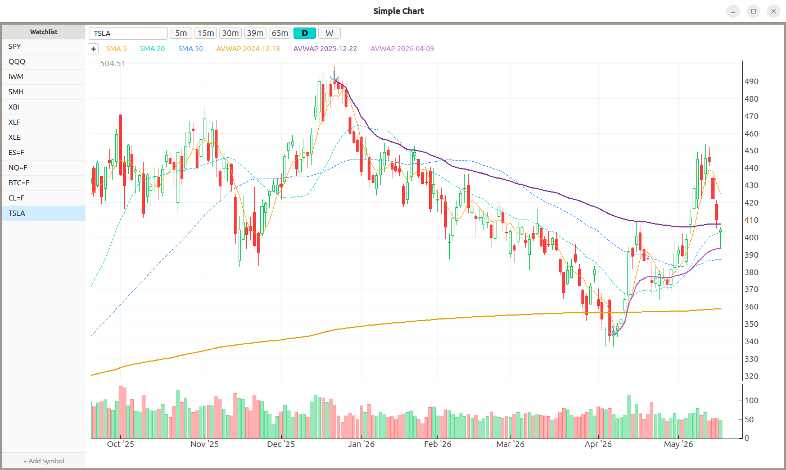

# Simple Chart

Simple Chart is a desktop stock charting application for swing traders. It comes
with an extensible API for custom indicators built using your AI agent of choice
(see [Building Custom Indicators](#building-custom-indicators)).

Included indicators:

- Simple Moving Average
- Exponential Moving Average
- Anchored VWAP
- Pivot Points
- Fibonacci Retracement
- RSI

The repository is structured for source-based local installation on Linux,
macOS, and Windows. The intended flow is:

1. Clone the repo.
2. Create a Python 3.13 virtual environment.
3. Install with `pip install -e .`.
4. Launch with `simplechart`.

No hard-coded personal paths are required.

## Requirements

- Python 3.13
- `pip`
- A desktop environment capable of running PyQt6 applications
- Internet access if dependencies need to be downloaded during install

## Fast Path

### Linux and macOS

```bash
python3.13 -m venv .venv
. .venv/bin/activate
python -m pip install --upgrade pip
python -m pip install -e .
simplechart
```

If `python3.13` is not available, use whichever command on the machine resolves
to Python 3.13 and verify with:

```bash
python --version
```

### Windows PowerShell

```powershell
py -3.13 -m venv .venv
.venv\Scripts\Activate.ps1
python -m pip install --upgrade pip
python -m pip install -e .
simplechart
```

If `py -3.13` is unavailable, install Python 3.13 first or use an equivalent
launcher that targets Python 3.13.

## What Gets Installed

`pip install -e .` installs:

- Python dependencies from `pyproject.toml`
- the `simplechart` command defined by the project entry point

The application stores its local SQLite database in a per-user location by
default:

- Linux and macOS: `~/.simplechart/simplechart.db`
- Windows: `%USERPROFILE%\.simplechart\simplechart.db`

You can override that location:

```bash
simplechart --db /path/to/simplechart.db
```

## Linux Desktop Launcher

Running from a terminal after `pip install -e .` is enough to use the app.

If you also want a desktop launcher and icon in Linux application menus:

```bash
python scripts/install_linux_desktop.py
```

That script installs:

- `io.simplechart.SimpleChart.desktop`
- `assets/simple-chart.svg`

into the current user's XDG data directories. It also rewrites the installed
desktop file so `Exec` and `TryExec` point at the `simplechart` executable from
the environment where the script was run.

## Platform Notes

### Linux

- Use the fast path above.
- If a launcher icon does not appear immediately after installing the desktop
  entry, log out and back in or restart the shell session for the desktop.

### macOS

- Use the fast path above.
- This repo currently targets source-based execution, not a native `.app`
  bundle.
- If a future release needs a native app bundle, use PyInstaller or py2app.

### Windows

- Use the PowerShell fast path above.
- This repo currently targets source-based execution, not a native installer.
- If a future release needs a native installer or shortcut setup, use
  PyInstaller or another Windows packaging tool.

## Troubleshooting

### `simplechart` command not found

The virtual environment is probably not active, or the editable install did not
complete successfully. Activate the venv and rerun:

```bash
python -m pip install -e .
```

### Wrong Python version

This project requires Python 3.13. Check with:

```bash
python --version
```

### GUI does not launch

Common causes:

- running in a headless environment
- missing desktop GUI support
- dependency install failure earlier in the setup flow

Try launching from the same terminal where the install was performed so any
Python traceback remains visible.

## Building Custom Indicators

SimpleChart has a stable public API for indicator authors and is designed to be
extended with the help of an AI agent. Indicators come in two flavors:

- **Compute** — chart overlays or panel indicators that convert OHLCV data into
  arrays (SMA, EMA, RSI).
- **Interactive** — indicators with context-menu actions, drag handles,
  persistent drawing state, or custom render output (Anchored VWAP).

To build one:

1. Use the development install so tests, type checks, and compiled kernels
   work:

   ```bash
   python -m pip install -e ".[dev]"
   ```

   Full environment setup details are in [`AGENT-SETUP.md`](AGENT-SETUP.md).

2. Tell your AI agent which kind of indicator you want, then prompt:

   > Read `AGENTS.md` and the appropriate file in `docs/skills/` before
   > building this indicator.

   The agent will read the project conventions, ask the right questions, and
   guide the work step by step.

Project conventions, the `simplechart.api` contract, and the full
indicator-building entry point live in [`AGENTS.md`](AGENTS.md).
