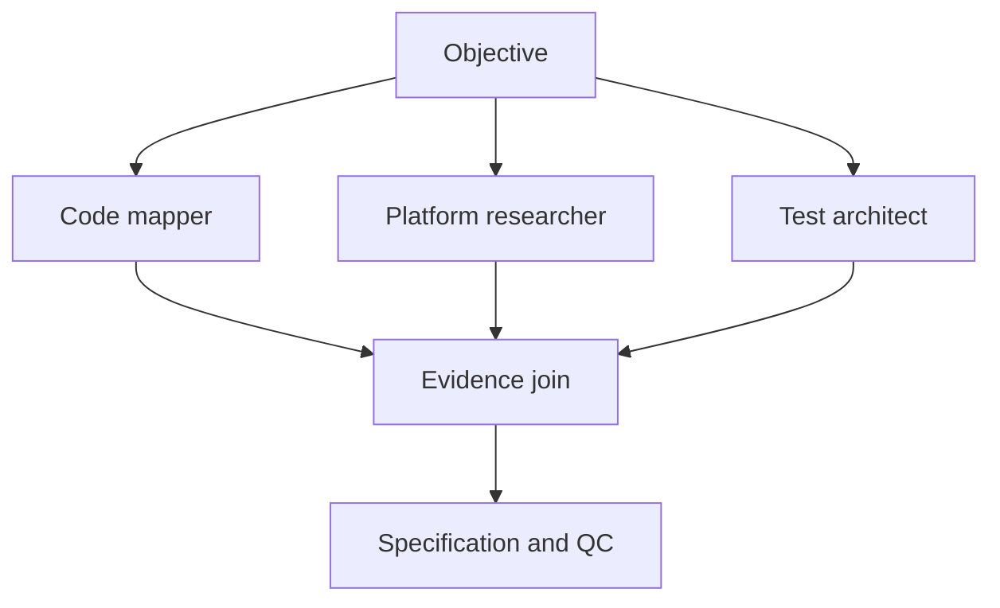

# Agentic Project Specification Template

Status: Draft | Approved | In progress | Complete | Blocked
Version:
Owner objective:
Approval profile: Gated autonomy | High-touch
Current graph phase:
Last updated:

Use this template for complex SimpleChart work that benefits from a durable
specification, TDD slices, independent QC, or multi-agent coordination. Remove
sections that are genuinely inapplicable; do not fill them with speculative
requirements.

## 1. Resumption state

```text
Last completed node:
Active node:
Active writer:
Files owned by active writer:
Pending join or gate:
Verified evidence available:
Known unrelated workspace changes:
Exact next transition:
```

## 2. User objective

State the desired outcome in the user's terms.

## 3. Problem statement and observed behavior

Separate **Observed** facts from **Inferred** conclusions. Include the
production reproduction or entry path when one exists.

## 4. Goals and non-goals

### Goals

-

### Non-goals

-

## 5. Quality attributes

Record the attributes that materially shape the design, such as correctness,
security, maintainability, performance, accessibility, portability, failure
isolation, and observability. Define how each will be verified.

## 6. Autonomy envelope

```text
Approval profile:
Approved objective:
In-scope behavior and layers:
Allowed writes:
Allowed verification:
Allowed external actions and data:
Prohibited actions:
Mandatory user gates:
Required reviewers:
Stop conditions:
Reporting cadence:
```

Under gated autonomy, internal adjustments may proceed without approval when
they preserve the approved behavior, architecture, security boundaries, and
acceptance criteria. Material amendments stop at a user gate.

## 7. Security and data boundaries

Identify credentials, sensitive data, trust boundaries, external transmission,
retention, logging, destructive operations, and required security references.

## 8. Current architecture and production path

```text
entry point -> orchestration -> domain logic -> side effects/output
```

Name the existing or proposed production call site.

## 9. User-visible behavior and interactions

Describe normal behavior, state transitions, failure behavior, cancellation,
accessibility, and platform-specific requirements.

## 10. Acceptance criteria

Number each criterion. Every criterion must be observable and falsifiable.

1.

## 11. TDD matrix

| Criterion | Test level | Intended RED reason | Required GREEN evidence | Production path covered |
|---|---|---|---|---|
| | | | | |

## 12. Implementation slices

Each slice declares one writer, expected file ownership, focused verification,
and its join into the production path.

| Slice | Behavior | Expected files | RED check | GREEN check | QC |
|---|---|---|---|---|---|
| | | | | | |

## 13. Research graph



For each delegated node, include the full contract required by
`docs/agentic-workflow.md`.

## 14. Risks and falsification checks

| Risk or assumption | Classification | Falsification check | Result |
|---|---|---|---|
| | Hypothesis | | Pending |

## 15. Open questions and user decisions

Only include questions that could materially change behavior, scope,
architecture, security, or acceptance criteria.

## 16. Design QC findings

| Finding | Reviewer | Severity | Disposition | Evidence and reason |
|---|---|---|---|---|
| | | | | |

## 17. Plan-change log

Record evidence-driven deviations from the approved mechanism.

| Change | Internal adjustment or material amendment | Evidence | Approval required | Result |
|---|---|---|---|---|
| | | | | |

Internal adjustments continue autonomously. Material amendments must record the
user decision before implementation.

## 18. Execution evidence

Record meaningful RED/GREEN/QC/verification joins, not raw command logs.

| Slice | RED evidence | GREEN evidence | QC disposition | Broader checks |
|---|---|---|---|---|
| | | | | |

## 19. Completion report

```text
Production call site:
Integration test proving the path:
Focused checks:
Broader checks:
QC findings and dispositions:
Known unrelated failures:
Remaining limitations:
Final acceptance:
```
