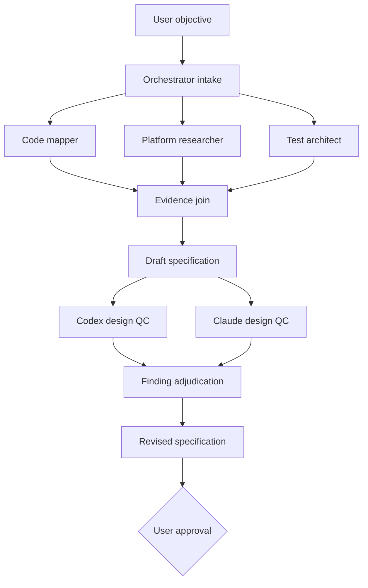
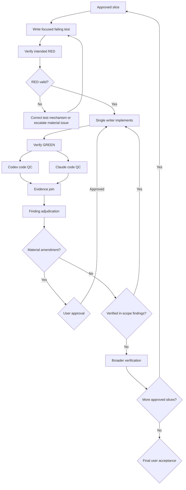

# SimpleChart Agentic Engineering Workflow

Status: Approved
Version: 1.1
Authority: Repository workflow supplement
Applies to: Explicitly approved agentic and multi-agent SimpleChart work

## 1. Purpose

This document defines how an orchestrating agent, specialist subagents,
external QC models, and deterministic tools collaborate on complex SimpleChart
work.

The workflow is designed to:

- Preserve the user's authority over scope and consequential actions.
- Follow `AGENTS.md` and all task-specific project instructions.
- Use test-driven development with observable red/green evidence.
- Obtain independent design and implementation review.
- Prevent concurrent agents from making conflicting changes.
- Keep external tools and models within explicit data and permission boundaries.
- Produce an inspectable decision trail without filling the main conversation
  with raw logs.
- Allow autonomous execution inside approved boundaries without requiring the
  user to review every mechanical step.

This workflow does not broaden authorization. A terminal objective such as
"finish the project" permits persistence toward that objective but does not
authorize unrelated changes, new dependencies, external writes, credential
handling, destructive operations, or bypassing review gates.

## 2. Instruction precedence

All agents must follow instructions in this order:

1. System and platform safety requirements
2. User instructions for the current task
3. Repository and nested `AGENTS.md` instructions
4. This workflow
5. Approved feature specification
6. Individual node contract

If instructions conflict, the orchestrator must stop, identify the conflict,
and request direction. A subagent must report a conflict to the orchestrator
rather than resolving it by expanding scope.

### Approval profiles and autonomy envelope

The repository default is **gated autonomy**.

Under gated autonomy, the user approves the objective, specification,
acceptance criteria, security and data boundaries, implementation graph, and
final result. Between those gates, the orchestrator may autonomously:

- Run approved read-only research and verification nodes.
- Write and verify focused RED tests for approved acceptance criteria.
- Implement approved slices with one writer at a time.
- Correct implementation details when evidence falsifies the planned
  mechanism but the correction stays within the approved boundaries.
- Adjudicate QC findings and run evidence-backed correction loops.
- Run approved focused and broader checks.
- Reorder or split internal implementation steps when behavior, boundaries,
  and file ownership remain unchanged.

The orchestrator must stop for user approval when work would:

- Change user-visible behavior, acceptance criteria, goals, or non-goals.
- Adopt a materially different architecture or cross a new layer boundary.
- Add, remove, or materially change a dependency.
- Change credential handling, security policy, privacy, retention, or data sent
  outside the machine.
- Send externally a category of material not already approved.
- Perform a destructive, irreversible, or source-control action.
- Expand into unrelated cleanup or a new objective.
- Resolve a product tradeoff not answered by the approved specification.
- Continue without a required reviewer or verification capability.
- Accept the final result.

A user may request **high-touch** execution, which inserts approval after each
logical unit. An approved graph may also add gates for a sensitive task. The
user may relax or tighten a gate explicitly, but agents may not infer broader
authority from a desire for speed or autonomy.

Every approved project artifact records its autonomy envelope:

```text
Approval profile:
Approved objective:
In-scope behavior and layers:
Allowed writes:
Allowed verification:
Allowed external actions and data:
Prohibited actions:
Mandatory user gates:
Required reviewers:
Stop conditions:
Reporting cadence:
```

Plan changes are classified before proceeding:

- **Internal adjustment:** Same behavior and boundaries; record the evidence
  and continue autonomously.
- **Material amendment:** Changes an approved boundary or product decision;
  stop and request approval before acting.
- **Unrelated finding:** Report it without fixing it.

## 3. Graph vocabulary

- **Node:** One bounded assignment performed by an agent or deterministic tool.
- **Edge:** A prerequisite or artifact required by another node.
- **Join:** A point where the orchestrator waits for multiple results and
  reconciles them.
- **Gate:** A point that requires explicit user approval.
- **Loop:** A controlled return to an earlier node after a falsified hypothesis,
  failed test, or verified review finding.
- **Artifact:** A durable or summarized output such as a specification, test
  matrix, diff, or verification report.
- **Orchestrator:** The primary agent responsible for graph ownership and
  communication with the user.
- **Writer:** The only agent authorized to edit the shared workspace during a
  particular node.

Only the orchestrator may spawn, redirect, interrupt, or close subagent work
unless a node contract explicitly authorizes nested delegation.

## 4. Roles

### Orchestrator

The orchestrator:

- Owns scope, sequencing, joins, gates, and final synthesis.
- Converts user intent into bounded node contracts.
- Ensures every agent receives the applicable constraints.
- Prevents simultaneous writers in the shared workspace.
- Reconciles conflicting findings using evidence.
- Routes verified findings into the correction loop.
- Communicates progress and decisions to the user.
- Stops at every approval gate required by `AGENTS.md`, the autonomy envelope,
  or the approved graph.
- Does not silently substitute one reviewer for another.

### Code mapper

Read-only responsibilities:

- Trace production entry points and execution paths.
- Identify relevant files, functions, state transitions, and tests.
- Report existing invariants and integration points.
- Separate observed behavior from inference.
- Avoid proposing implementation unless requested.

### Platform or documentation researcher

Read-only responsibilities:

- Verify framework, operating-system, and library behavior.
- Prefer authoritative primary documentation.
- Identify version- or platform-specific limitations.
- Distinguish documented behavior from inference.
- Report links or exact references when external research is used.

### Test architect

Read-only during specification:

- Translate acceptance criteria into observable tests.
- Identify unit, interaction, integration, and manual checks.
- Define what failure should occur before implementation.
- Flag behavior that cannot be tested reliably in a headless environment.
- Ensure the production call path is exercised.

The test architect may become the single writer for an approved red-test node.

### Implementation worker

Write-enabled only for an approved slice:

- Own only the specified files and behavior.
- Implement the smallest change satisfying the approved tests and specification.
- Avoid unrelated cleanup or speculative abstractions.
- Stop if the approved tests appear incorrect or incomplete.
- Never weaken a test merely to obtain a green result.
- Return a concise change and verification report.

### Codex QC reviewer

Read-only responsibilities:

- Review the design plan or implementation independently.
- Focus on correctness, regressions, integration gaps, security,
  maintainability, and test quality.
- Avoid unsupported style-only findings.
- Supply evidence and a falsification check for each substantive finding.

### Claude QC reviewer

Claude is an external, read-only review node.

Claude receives a bounded review packet containing only approved material and:

- Reviews the design objective before implementation.
- Challenges assumptions, non-goals, acceptance criteria, architecture, test
  coverage, and implementation slicing.
- Reviews the post-green diff for correctness and missing coverage.
- Cannot edit the workspace or communicate directly with implementation
  workers.
- Cannot approve its own findings or transition the graph.
- Must not receive credentials, private databases, unrelated source, or
  unapproved sensitive material.

If Claude is required by the approved graph but unavailable, the orchestrator
must stop at the QC gate and ask the user whether to wait, retry, waive the
requirement, or substitute another reviewer.

### Verifier

The verifier is evidence-focused and normally read-only:

- Runs approved focused tests and broader checks.
- Confirms that red tests fail for the intended reason.
- Confirms that green tests exercise the production behavior.
- Runs linting, typing, and integration checks appropriate to the risk.
- Classifies failures as related, unrelated, or uncertain using evidence.
- Does not fix unrelated failures.
- Does not equate a model opinion with verification.

## 5. Delegation contract

Every delegated node must specify:

```text
Node:
Objective:
Inputs:
Relevant files:
Allowed actions:
Prohibited actions:
Write authority:
Required evidence:
Required output:
Stop conditions:
Applicable approval gate:
```

A subagent must not infer permission beyond this contract.

Examples of prohibited ambiguity include:

- "Review everything."
- "Fix whatever you find."
- "Use any tools necessary."
- "Make the architecture better."

Each assignment must identify a bounded outcome and explicit tool authority.

## 6. Concurrency and workspace ownership

All agents share the same workspace.

Therefore:

- Only one writer may be active at a time.
- The orchestrator and other agents must not edit while a writer node is active.
- Parallel nodes should normally be read-heavy: exploration, research, test
  design, review, or result analysis.
- Every write node must declare its expected file ownership.
- A writer must inspect existing changes before editing and preserve unrelated
  user work.
- Overlapping or unexplained changes require the node to stop and report.
- Worktrees, branches, commits, resets, and other source-control operations
  remain the user's responsibility unless explicitly authorized.
- Subagents may not spawn additional writers.

The current environment allows the orchestrator and up to three subagents to
run concurrently. The graph should use waves when more roles are needed.

## 7. Specification graph

For a feature requiring agentic engineering:



The specification must include:

- Problem statement
- Observed current behavior
- Goals
- Non-goals
- User-visible behavior
- State and interaction requirements
- Platform requirements
- Accessibility requirements where applicable
- Production integration path
- Acceptance criteria
- TDD test matrix
- Implementation slices
- Risks and falsification checks
- Open questions
- QC findings and dispositions

No production or test code may be edited before the specification is approved.

## 8. Design QC requirements

Both Codex QC and Claude QC receive the same design packet:

- User objective
- Relevant `AGENTS.md` constraints
- Draft specification
- Existing architecture summary
- Proposed acceptance criteria
- Test matrix
- Implementation slices
- Known risks and open questions

Each finding must contain:

```text
Finding ID:
Severity:
Claim:
Evidence:
Impact:
Falsification check:
Suggested disposition:
Confidence:
```

The orchestrator classifies each finding:

- **Accepted:** Evidence supports changing the plan.
- **Rejected:** Evidence does not support the finding.
- **Deferred:** Valid but outside the approved objective.
- **Needs user decision:** Material tradeoff requiring product direction.
- **Duplicate:** Already represented by another finding.

Disagreements between reviewers must be shown to the user when they materially
affect scope, behavior, safety, or architecture.

The revised plan returns to the user for approval. Reviewer approval alone is
insufficient.

## 9. TDD implementation graph

Each approved logical slice follows:



### Red phase

The red phase must demonstrate:

- The new test expresses an approved acceptance criterion.
- It fails before implementation.
- It fails for the intended missing behavior.
- It does not fail because of broken setup, unrelated behavior, or an invalid
  assumption.

After the red-test logical unit is complete, the orchestrator reports the RED
evidence. Under gated autonomy, implementation may begin without another user
approval when the test expresses an already approved acceptance criterion and
fails for the intended reason. A high-touch graph waits for approval here.

If the test mechanism is wrong, it may be corrected autonomously with evidence.
If the acceptance criterion or approved behavior is wrong, the orchestrator
stops for a material-amendment decision.

### Green phase

The implementation worker:

- Changes only the approved behavior.
- Does not change the accepted test unless the test is proven incorrect.
- Runs focused verification.
- Returns control to the orchestrator.

After the implementation logical unit is complete, the orchestrator reports
the change and GREEN evidence. Under gated autonomy, QC and verification may
continue without another user approval. High-touch graphs wait where specified.

### Refactor phase

Refactoring is not automatic.

A refactor requires one of:

- It is necessary to satisfy the approved behavior safely.
- It is explicitly included in the approved specification.
- A verified QC finding demonstrates that the implementation is materially
  unsafe or unmaintainable without it.
- The user separately approves it.

The first three cases may proceed autonomously only when they remain inside the
approved architecture, file ownership, and behavior. Otherwise the refactor is
a material amendment and requires approval.

## 10. Verification requirements

Verification must be proportional to risk and may include:

- Focused unit tests
- Interaction tests
- Production-path integration tests
- Full test suite
- Ruff
- mypy
- Compilation checks
- Runtime reproduction
- Visual inspection
- Platform-specific checks

For UI work, verification should distinguish:

- **Structural:** Widgets, flags, geometry, state, and ownership.
- **Interaction:** Click, drag, resize, keyboard, focus, and state transitions.
- **Integration:** Real application construction and production call sites.
- **Visual:** Human-observable appearance under specified backgrounds, themes,
  DPI values, or platforms.

A full-suite failure may be called unrelated only when evidence supports that
classification. Unrelated failures are reported but not fixed.

## 11. Tool and permission policy

Agents must use the narrowest tool appropriate to their node.

- Repository searches and reads are permitted when relevant.
- Network research is used only when current or authoritative external
  information is necessary.
- External services receive only the minimum approved context.
- External writes, messages, uploads, or state changes require authorization.
- Destructive operations require explicit scope resolution and approval.
- Dependencies require explicit user approval.
- Credential values must never enter prompts, logs, source files,
  configuration files, command arguments, test artifacts, or QC packets.
- Credential-related SimpleChart work must follow
  `docs/credential-security.md`.
- Git and source-control operations remain the user's responsibility.
- Agents must not weaken the sandbox or circumvent an approval denial.
- Tool failure does not authorize an alternate unsafe route.

## 12. Claude integration boundary

Before Claude becomes an active graph node, a separate approved infrastructure
task must define:

- Connection mechanism
- Authentication mechanism
- Data sent to Claude
- Data excluded from Claude
- Model selection
- Review prompt and output schema
- Timeout and retry behavior
- Failure behavior
- Logging and retention
- User consent expectations
- A harmless validation fixture

Claude integration must not begin by embedding provider credentials in the
SimpleChart repository.

Until this connection is approved and verified, Claude remains a planned but
unavailable graph node.

## 13. Progress communication

Before each wave, the orchestrator reports:

- Nodes being started
- Each node's scope
- Which nodes are read-only
- Whether a writer is active
- The expected join or gate

During longer work, the orchestrator provides concise updates without flooding
the main thread with raw logs.

Completing a logical unit always requires an evidence update. It requires a
pause only when the active approval profile or a mandatory gate says so.

At each join, the orchestrator reports:

- Agent results
- Agreements
- Disagreements
- Evidence quality
- Adjudicated findings
- Remaining uncertainty
- Proposed next transition

The final response for a completed slice names:

- Production call site
- Test proving integration
- Checks performed
- Known unrelated failures
- Remaining limitations
- Whether further approval is required

## 14. Failure and interruption handling

- A timed-out or failed agent node may be retried only when retrying is safe and
  useful.
- A required reviewer may not be silently omitted.
- A subagent exceeding scope must be interrupted.
- An unverified proposed fix must not advance the graph.
- After two failed debugging hypotheses, the graph returns to first-principles
  analysis.
- A failed implementation attempt must be undone before a different mechanism
  is tried.
- If required authority, credentials, external access, or a product decision
  is missing, the orchestrator stops and asks the user.
- New user input may replace or amend the active graph; the orchestrator must
  identify which interpretation applies.

## 15. Session startup and resumption

This section applies only when an agentic project begins or resumes in a
different session. It does not require creating a new session at completion.

A new specification session reads:

1. `AGENTS.md`
2. This workflow
3. The task brief and relevant references

A new implementation session reads:

1. `AGENTS.md`
2. This workflow
3. The approved feature specification
4. Directly referenced security or extension instructions

The opening request must identify the current graph phase so the orchestrator
does not repeat completed work or advance past an approval gate.

The orchestrator must not rely on undocumented conversational memory when a
durable artifact exists.

Durable resumption state does not itself schedule or trigger another Codex
turn. Ordinary work resumes only when the user or product supplies a new
trigger. If automatic multi-turn continuation is required, the user must
explicitly start Codex goal mode for the objective; approval to proceed is not
implicit authorization to create a goal.

Use `docs/agentic-project-template.md` for new complex objectives and
`docs/agentic-startup-checklist.md` when starting or resuming them. The active
artifact must identify the current graph node, completed evidence, active
writer if any, pending gates, plan adjustments, and exact next transition.

## 16. Completion criteria

An agentic project is complete only when:

- The approved acceptance criteria are satisfied.
- The production path uses the implementation.
- Integration coverage proves that path is connected.
- Required focused and broader checks have run.
- Codex and Claude QC findings are adjudicated or explicitly waived.
- No required logical unit remains.
- Known unrelated failures and limitations are reported.
- The user has received the final evidence-backed handoff.

## 17. Reusable project artifacts

Complex work uses one durable project artifact created from
`docs/agentic-project-template.md`. It contains the approved specification,
autonomy envelope, graph state, TDD evidence, QC dispositions, plan-change log,
and final verification report.

The artifact is updated at meaningful joins and gates rather than used as a
raw activity log. It must be sufficient for a new orchestrator to resume the
exact graph node without relying on conversational memory.
